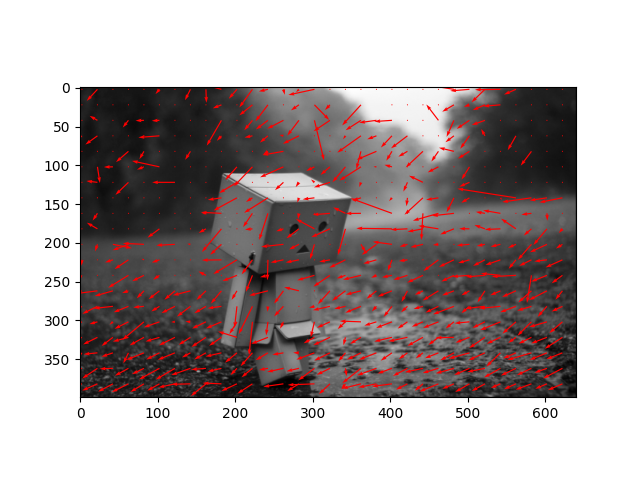
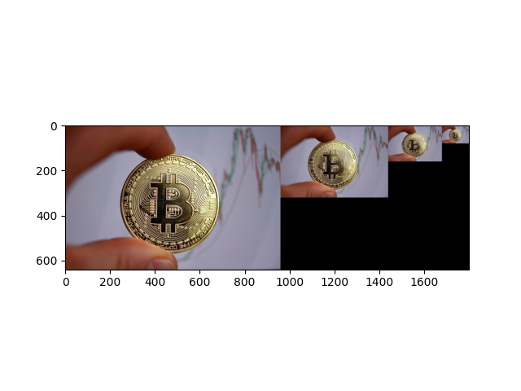
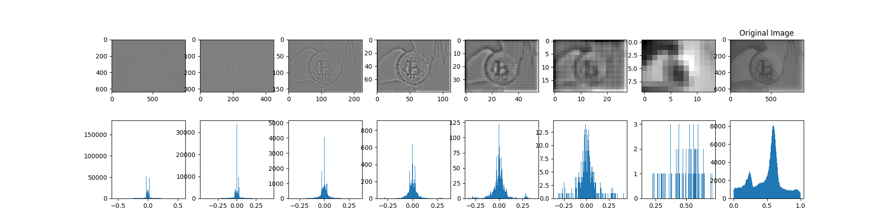
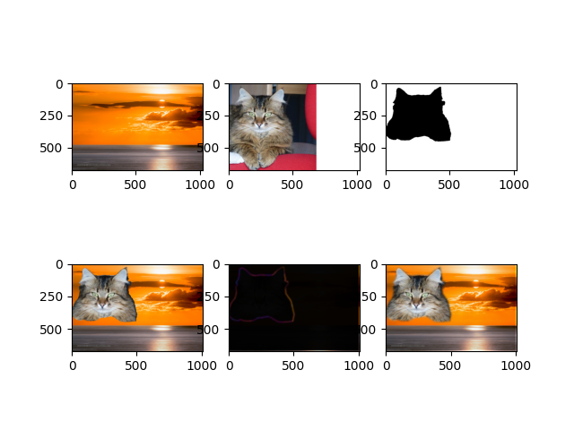
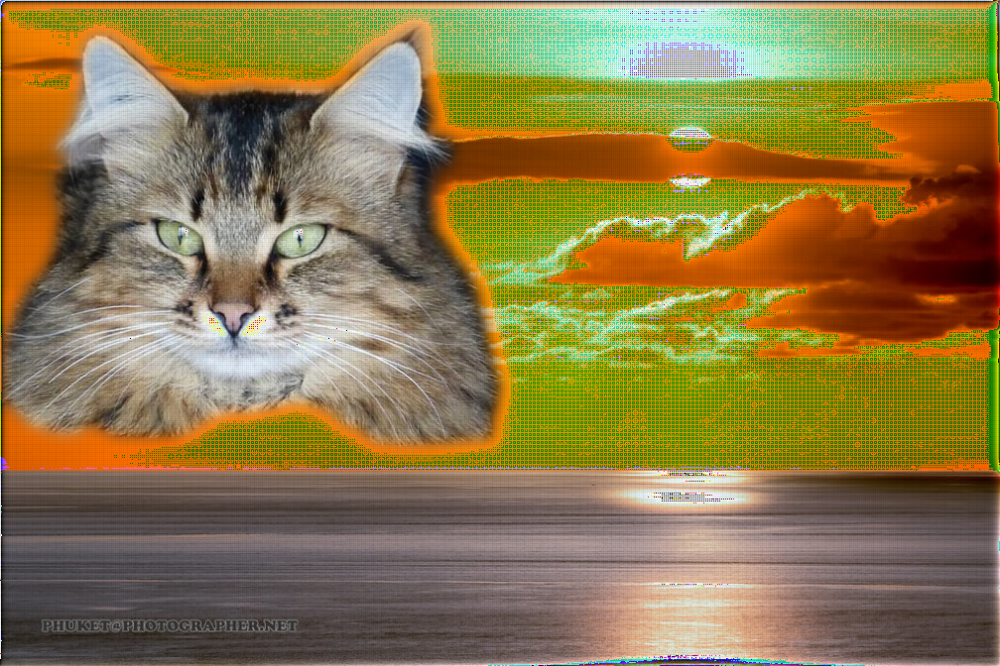

# Pyramids and Optical Flow

## Overview

This project implements several classical computer vision techniques using Python, NumPy, and OpenCV.

The repository demonstrates:

- Lucas–Kanade Optical Flow
- Gaussian Image Pyramids
- Laplacian Image Pyramids
- Pyramid Image Blending

The goal is to demonstrate how **multi-scale image representations** can be used for motion estimation and seamless image blending.

---

## Repository Structure

```
Ex3_Pyramids_and_Optic_Flow/
|
|-- ex3_utils.py      # Implementation of the algorithms
|-- main.py           # Demo script
|-- input/            # Input images
|-- result/           # Output images generated by the program
|-- README.md
```

---

## Implemented Methods

### Optical Flow (Lucas–Kanade)

```python
opticalFlow(img1, img2, step_size, win_size)
```

This function estimates motion between two images using the **Lucas–Kanade optical flow algorithm**.

The algorithm:

1. Computes spatial image gradients
2. Computes temporal differences between frames
3. Solves a least squares problem to estimate motion vectors

The output is a set of motion vectors describing the displacement between the two images.



---

### Gaussian Pyramid

```python
gaussianPyr(img, levels)
```

A Gaussian pyramid represents an image at multiple resolutions.

Each level:
- Applies Gaussian smoothing
- Downsamples the image by a factor of 2

This produces progressively smaller images while preserving the overall structure of the original image.



---

### Laplacian Pyramid

```python
laplaceianReduce(img, levels)
laplaceianExpand(pyramid)
```

The Laplacian pyramid captures image details between Gaussian pyramid levels.

Construction:

1. Build a Gaussian pyramid
2. Expand the higher level
3. Subtract it from the current level

This stores the high-frequency details of the image.

The original image can later be reconstructed using `laplaceianExpand`.



---

### Pyramid Image Blending

```python
pyrBlend(img1, img2, mask, levels)
```

This function blends two images using a mask and pyramid blending.

Steps:

1. Build Laplacian pyramids for both images
2. Build a Gaussian pyramid for the mask
3. Combine pyramid levels using the mask
4. Reconstruct the final blended image

This technique avoids sharp seams between the images.





---

## Run the Project

Install dependencies:

```bash
pip install numpy opencv-python scipy matplotlib
```

Run the program:

```bash
python main.py
```

-------------------------------------------------------

###### Ariel University, Israel || Semester B, 2021

